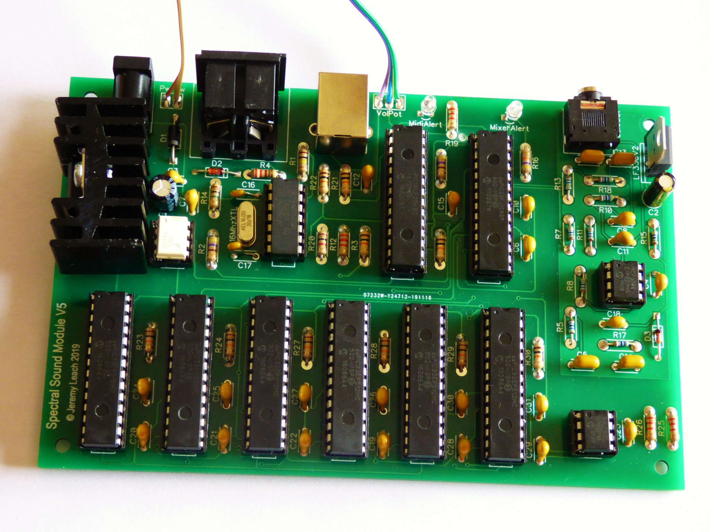
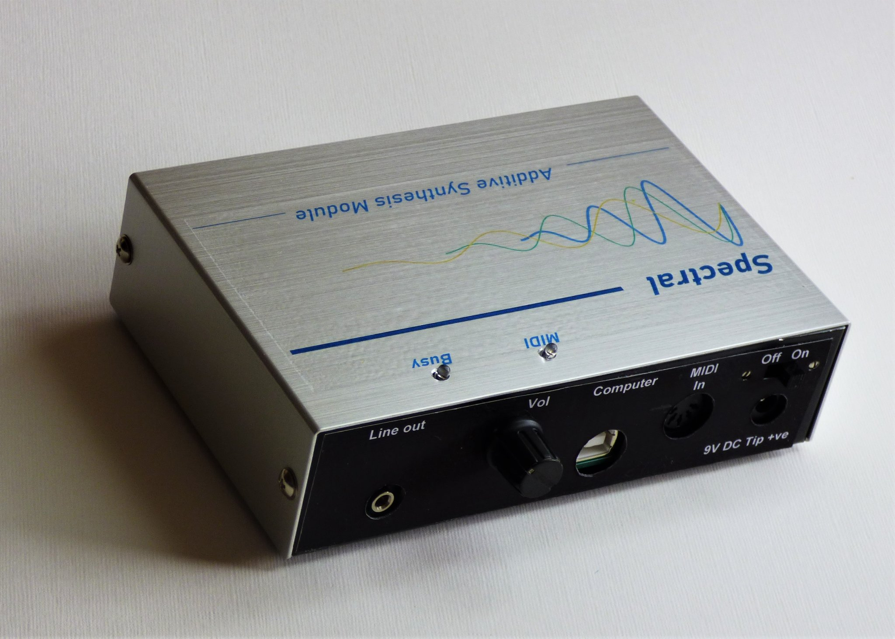

# Spectral-Sound-MIDI-Synthesiser
This is an Additive Synthesis Module available as a kit from the Australian Silicon Chip Magazine (see June 2022 edition article). The synthesiser comprises a PCB with Microchip MPLABX C firmware, and an associated Windows Patch Editor App, written in C# Winforms. This repository holds all software, documentation, examples and links. 

The synth article was in the Silicon Chip Magasine June 2022:

PCB V5:

Enclosure:

