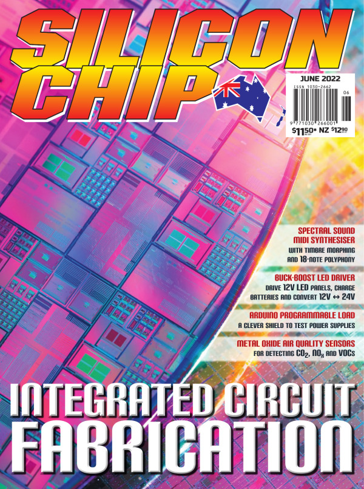

# Spectral-Sound-MIDI-Synthesiser
This is an Additive Synthesis Module available as a kit from the Australian Silicon Chip Magazine (see June 2022 edition article). The synthesiser comprises a PCB with Microchip MPLABX C firmware, and an associated Windows Patch Editor App, written in C# Winforms. This repository holds all software, documentation, examples and links. 

# Getting started
To get started with the module you'll need to install the Windows App, then connect the module via USB. The module doesn't have any inbuilt sounds until you load some.
- Open the Windows app. It will preconfigure the initial patch for a basic sound.
- With the USB cable connected to the module, select the menu option 'Tools>Synchronize data with the module' (or click the sync button). This will send the patch to the module.
- Connect a MIDI controller keyboard (or any MIDI keyboard), SET TO TRANSMIT ON CHANNEL 1 (because the module defaults to channel 1).
- Connect the audio output to your amplifier (the audio output is line-level and NOT a headphone output).

You should be able to play and hear sounds (make sure the volume control on the module is set to max to make sure it's outputting sound).

To make the sounds remain on the module you'll need to click the 'Module Data' tab, create a PatchSet then save this PatchSet to the module. 

It's highly recommended to read the help file in the app !

The synth article was in the Silicon Chip Magasine June 2022:

PCB V5:

Enclosure:

