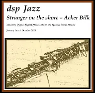

# Clarinet Sound Examples

## Stranger on the Shore, for Clarinet and Piano Video

This Jazz standard, written by Acker Bilk for his daughter, is recreated here solely using the sounds from the Spectral Sound Module (for both Piano and Clarinet).

### Video Demonstration

Click the image above to watch the video demonstration on YouTube: "Clarinet and Piano sounds recreated purely on this Synth".
