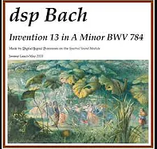
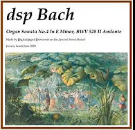

# Ensemble Sound Examples
All these examples have been created solely from the Synth Module, driven by a MIDI sequencer. The different parts have been created separately then mixed in Audacity.

## Bach Invention13

Click image to watch video on YouTube.

## Bach Organ Sonata No.4 In E Minor, BWV 528 II Andante

Click image to watch video on YouTube.

