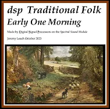
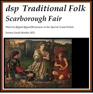
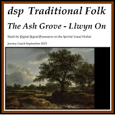

# Flute Sound Examples
All these examples have been created solely from the Synth Module, driven by a MIDI sequencer. The different parts have been created separately then mixed in Audacity.

## Spectral Definition Language (SDL) Code for a Flute Sound
- [Download SDL code for Flute 2.3 as a PDF](Flute_2_3.pdf)

This PDF contains the Spectral Definition Language (SDL) code for synthesizing a flute sound. The SDL code demonstrates how to configure various parameters to achieve a realistic flute tone, suitable for use with the Spectral Sound MIDI Synthesiser.

## Early One Morning
A traditional English folk song, dating to 1787.

Click image to watch video on YouTube.

## Scarborough Fair
A traditional English folk piece, dating back many centuries.

Click image to watch video on YouTube.

## The Ash Grove
A traditional Welsh piece, ascribed to Llwyn On.

