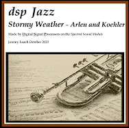

# Trumpet Sound Examples

## Spectral definition language (SDL) code for a trumpet sound
- [Download SDL code for Trumpet 2.0 as a pdf](Trumpet_2_0.pdf)

## Stormy Weather

Click image to watch video on YouTube.

## Blue Skies
- [Download WAV Example Sound](TrumpetExample_BlueSkies.wav)

