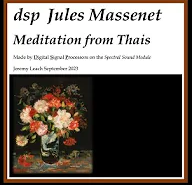

# Violin Sound Examples

## Spectral Definition Language (SDL) Code for a Violin Sound
- [Download SDL code for Violin 2.3 as a PDF](Violin2_3.pdf)

This PDF contains the Spectral Definition Language (SDL) code for synthesizing a violin sound. The SDL code demonstrates how to configure various parameters to achieve a realistic violin tone, suitable for use with the Spectral Sound MIDI Synthesiser.

## Meditation from Thais, for Violin and Piano
This beautiful piece is recreated here solely using the sounds from the Spectral Sound Module (both Piano and Violin). 

Click image to watch video on YouTube. 

